# Threat Hunt Report - Scattered Invoice

**Case:** IR-2026-0225-BEC · LogN Pacific Financial Services // Finance Department
**Platform:** Microsoft Sentinel // Entra ID, Cloud Apps, Exchange Online
**Window:** 25 Feb 2026, 21:00 UTC to 26 Feb 2026, 00:00 UTC


---

## 1. Complete Scenario

### Summary

LogN Pacific Financial Services' bank froze a £24,500 wire transfer after their fraud department flagged it as suspicious. The finance team insisted they had followed procedure: the payment instruction came from a known colleague's real mailbox. It had. Finance analyst Mark Smith had already handed the attacker his password, likely lifted by infostealer malware, and the previous evening was hit with a burst of MFA push notifications until, tired of the noise, he approved one. From an unmanaged Linux device running Firefox in the Netherlands, the attacker walked straight past Conditional Access (which never evaluated the session at all), read Mark's inbox, and within minutes planted two inconspicuously named mailbox rules: one silently forwarding anything mentioning invoices, payments, or wire transfers to an external address, the other auto-deleting any email containing words like "suspicious" or "compromised" before Mark could ever see a warning. The attacker then hijacked a live invoice thread to redirect payment to their own account, and separately touched OneDrive and SharePoint before the session ended. Every step, from the MFA fatigue attack through the mailbox rules to the fraudulent wire, matched the known playbook of **Scattered Spider**, the group behind the MGM Resorts and Caesars Entertainment intrusions.

---

**// IR OPENING BRIEF // LogN Pacific Financial Services**

> From: IR Lead
> To: Threat Hunt // On-Shift
> Re: IR-2026-0225-BEC, confirmed fraudulent wire transfer
>
> We have a confirmed fraudulent wire transfer. £24,500 redirected to an unknown account. The bank caught it and froze the funds. Finance say they followed procedure, they got an email from a known colleague with updated banking details and processed it.
>
> That colleague is Mark Smith. Mark reported weird MFA notifications last night. He approved one just to make it stop. This morning his team found inbox rules nobody created.
>
> I need you in the sign-in logs now. Confirm the compromise, identify the attacker's infrastructure, and tell me how they got past MFA. Clock is running.
>
> **Directive:** Confirm the compromise. Identify the attacker's infrastructure. Scope the damage. Determine what inbox rules were created, what emails were sent, and what data was accessed. Identify the threat actor.
>
> **Threat intel:** This pattern, MFA fatigue, help desk social engineering, BEC targeting finance teams, and use of legitimate cloud infrastructure against hospitality, retail, and financial services, matches a known financially motivated group. They've previously hit MGM Resorts, Caesars Entertainment, and multiple UK retailers.
>
> **OPSEC:** This is realistic simulated telemetry. Do not contact any email address found in the logs. Do not submit IPs or domains to public threat intelligence platforms. Investigate, do not interact.

---

### Live Announcement

> 🔴 **HUNT 02 // SCATTERED INVOICE // LIVE**

> A confirmed fraudulent wire transfer, £24,500, frozen at the bank before it left the building. Finance did everything right on paper: the email came from a real colleague's real mailbox.
>
> That's the problem. Mark Smith's account isn't lying, it's compromised. Weird MFA notifications last night, one approved just to make them stop, and mailbox rules nobody remembers creating.
>
> Trace it from the sign-in logs forward: how they got past MFA, what they touched, where the money went, and who they are.
>
> Difficulty: **Intermediate**
>
> Flags: **29** // 6 phases

---

### How To Hunt This [ method, not answers ]

A BEC case built on a real kill chain. The skill here is following one attacker session across three separate log sources without losing the thread.

**01** Baseline the user first. Compare Mark's normal sign-in pattern against the evening session before trusting anything else.

**02** MFA failure codes tell a story. A denial isn't a block, read what the code actually means.

**03** Device profile is a signature. OS, browser, and geography rarely lie about who's really behind the keyboard.

**04** Inbox rules hide in plain sight. A one-character rule name isn't a UI quirk, it's tradecraft.

**05** Pivot across tables. Sign-in, cloud app, and email telemetry only tell the full story joined by IP and session ID.

**06** Absence is evidence too. A Conditional Access field that reads "notApplied" is a finding, not a null result.

---

### ATT&CK Kill Chain // Investigation Phases

| Phase | Focus |
|---|---|
| **01** | MFA Bypass: how the attacker defeated multi-factor authentication |
| **02** | Account Takeover: confirming the compromise and the first post-authentication action |
| **03** | Persistence: inbox rules built to forward invoices and hide security alerts |
| **04** | Scope & Correlation: cloud apps touched beyond email, and the session tying it all together |
| **05** | Detection Gaps & Attribution: what defences failed, and mapping the technique to MITRE ATT&CK and the threat actor |
| **06** | Financial Fraud & Containment: where the money went, and the first action taken to stop it |

> **Note on the gap.** The strongest defensive finding here isn't something the attacker did, it's something the organisation's controls didn't do. Conditional Access never evaluated the session at all. Reason from that gap: it's why an unmanaged Linux device on Firefox, signing in from the Netherlands, walked straight through once a single MFA push was approved.

---

## 2. Objective

Work IR-2026-0225-BEC as a live business email compromise investigation:

- Confirm the compromised identity and the attacker's source infrastructure
- Establish how multi-factor authentication was defeated
- Identify what the attacker did immediately after authenticating, and in what order
- Recover the persistence mechanism used to hide the compromise from the victim
- Trace the fraudulent invoice email to its recipient and confirm it came from the same attacker session
- Scope the compromise beyond email into any other cloud applications touched
- Identify the control gap that let the session through unchallenged
- Map the observed techniques to MITRE ATT&CK and attribute the activity to a known threat actor
- Recommend the correct immediate containment action

---

## 3. Tools & Technologies

| Tool / Technology | Role in the Hunt |
|---|---|
| Microsoft Sentinel | Central query surface: `law-cyber-range` workspace |
| KQL | Query language used across all three tables |
| SigninLogs | Authentication: result codes, IP, device detail, Conditional Access status |
| CloudAppEvents | Post-authentication activity: mail access, inbox rule creation, OneDrive/SharePoint access, session ID |
| EmailEvents | The fraudulent invoice email: sender, recipient, subject, and direction |
| MITRE ATT&CK | Technique mapping for MFA fatigue and email-rule defense evasion |

---

## 4. Flags

### 🚩 Flag 1: Compromised Account

**What to find:** Before you can investigate, confirm the compromised identity. Query SigninLogs for the user identified in the incident.

**Flag Data Block**

| Field | Value |
|---|---|
| **Answer** | m.smith@lognpacific.org |
| **Time (UTC)** | 2026-02-25T22:31:19.6689495Z |

**Details:** The successful sign-in activity identifies m.smith@lognpacific.org as the compromised finance account under investigation.

**Query:**
```kql
SigninLogs
| where TimeGenerated between (datetime(2026-02-25 21:00:00) .. datetime(2026-02-26 00:00:00))
| where ResultSignature == "SUCCESS"
| where UserPrincipalName contains "smith"
| project-reorder TimeGenerated, UserPrincipalName, *
```

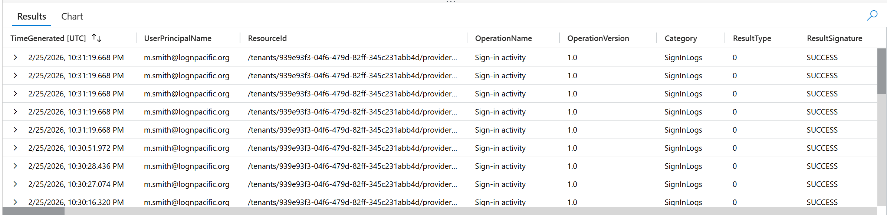

---

### 🚩 Flag 2: Attacker Source IP

**What to find:** Mark authenticated from his usual location during the day. Someone else authenticated as Mark from somewhere else during the evening. Baseline his sign-in activity and isolate the second source.

**Flag Data Block**

| Field | Value |
|---|---|
| **Answer** | 205.147.16.190 |
| **Time (UTC)** | 2026-02-25T22:31:19.6689495Z |

**Details:** The successful evening authentication for m.smith@lognpacific.org originated from the attacker source IP 205.147.16.190, distinct from Mark's usual location.

**Query:**
```kql
SigninLogs
| where TimeGenerated between (datetime(2026-02-25 21:00:00) .. datetime(2026-02-26 00:00:00))
| where ResultSignature == "SUCCESS"
| where UserPrincipalName contains "smith"
| project-reorder TimeGenerated, UserPrincipalName, *
| distinct IPAddress
```

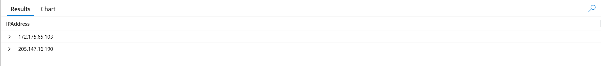

---

### 🚩 Flag 3: Attack Origin Country

**What to find:** Determine where the attacker's IP geolocates to. Does an employee suddenly authenticating from another country make sense?

**Flag Data Block**

| Field | Value |
|---|---|
| **Answer** | NL |
| **Time (UTC)** | 2026-02-25T22:31:19.6689495Z |

**Details:** The attacker source IP 205.147.16.190 geolocates to NL, indicating the evening authentication originated from the Netherlands.

**Query:**
```kql
SigninLogs
| where TimeGenerated between (datetime(2026-02-25 21:00:00) .. datetime(2026-02-26 00:00:00))
| where ResultSignature == "SUCCESS"
| where IPAddress == "205.147.16.190"
| project TimeGenerated, LocationDetails
| take 3
```

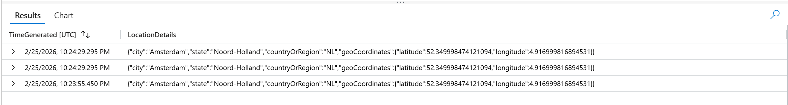

---

### 🚩 Flag 4: MFA Denial Error Code

**What to find:** What error code indicates strong authentication was required but not completed?

**Flag Data Block**

| Field | Value |
|---|---|
| **Answer** | 50074 |
| **Time (UTC)** | 2026-02-25T22:24:32.8695282Z |

**Details:** The attacker IP returned error code 50074, indicating that strong authentication (MFA) was required but not completed.

**Query:**
```kql
SigninLogs
| where TimeGenerated between (datetime(2026-02-25 21:00:00) .. datetime(2026-02-26 00:00:00))
| where IPAddress == "205.147.16.190"
| distinct ResultType
```

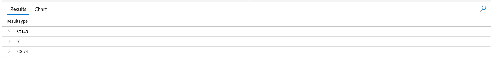

```kql
SigninLogs
| where TimeGenerated between (datetime(2026-02-25 21:00:00) .. datetime(2026-02-26 00:00:00))
| where IPAddress == "205.147.16.190"
| where ResultType == "50074"
| project ResultType, ResultSignature, ResultDescription
| take 1
```

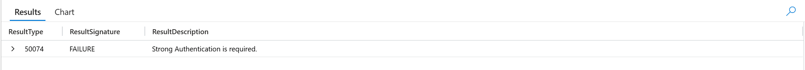

---

### 🚩 Flag 5: MFA Fatigue Intensity

**What to find:** Mark said he was getting repeated MFA push notifications, denied them, then approved one just to make them stop. How many did he deny first?

**Flag Data Block**

| Field | Value |
|---|---|
| **Answer** | 3 |
| **Time (UTC)** | 2026-02-25T22:24:32.8695282Z |

**Details:** Mark denied 3 MFA push requests before approving one.

**Query:**
```kql
SigninLogs
| where TimeGenerated between (datetime(2026-02-25 21:00:00) .. datetime(2026-02-26 00:00:00))
| where IPAddress == "205.147.16.190"
| summarize count() by ResultType
```

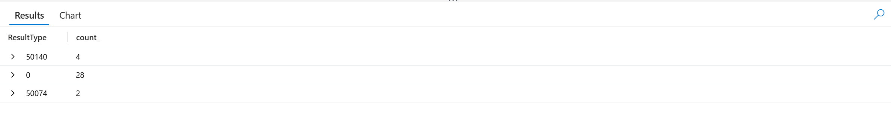

---

### 🚩 Flag 6: Application Accessed

**What to find:** After beating MFA, the attacker accessed a specific Microsoft application. A remote attacker without the desktop app installed would use the web version.

**Flag Data Block**

| Field | Value |
|---|---|
| **Answer** | One Outlook Web |
| **Time (UTC)** | 2026-02-25T22:24:32.8695282Z |

**Details:** The attacker authenticated to the Microsoft application logged as One Outlook Web.

**Query:**
```kql
SigninLogs
| where TimeGenerated between (datetime(2026-02-25 21:00:00) .. datetime(2026-02-26 00:00:00))
| where IPAddress == "205.147.16.190"
| where ResultType == "50074"
| project TimeGenerated, AppDisplayName
```

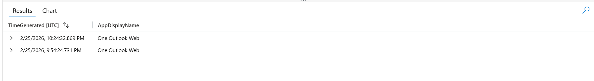

---

### 🚩 Flag 7: Attacker Operating System

**What to find:** Mark's corporate device runs Windows on a managed endpoint. Compare device profiles between the legitimate and malicious sessions.

**Flag Data Block**

| Field | Value |
|---|---|
| **Answer** | Linux |
| **Time (UTC)** | 2026-02-25T22:24:32.8695282Z |

**Details:** Comparing device profiles between Mark's legitimate sessions and the evening authentication from 205.147.16.190 shows the attacker's session came from a device running Linux, a stark contrast to Mark's managed Windows corporate endpoint.

**Query:**
```kql
SigninLogs
| where TimeGenerated between (datetime(2026-02-25 21:00:00) .. datetime(2026-02-26 00:00:00))
| where IPAddress == "205.147.16.190"
| where ResultType == "50074"
| project TimeGenerated, DeviceDetail
```

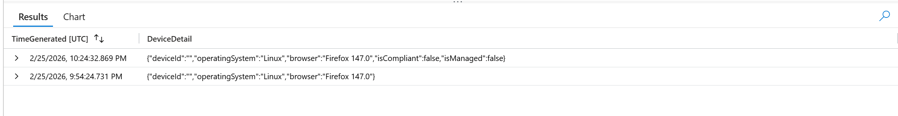

---

### 🚩 Flag 8: Attacker Browser

**What to find:** Cross-reference with Mark's normal browser. Different browser, different OS, different country, three anomaly layers beyond just the IP.

**Flag Data Block**

| Field | Value |
|---|---|
| **Answer** | Firefox 147.0 |
| **Time (UTC)** | 2026-02-25T22:24:32.8695282Z |

**Details:** The same device profile check that surfaced the Linux host also shows the attacker's session used Firefox 147.0, layering a third anomaly (browser, OS, and country all breaking from Mark's normal baseline) on top of the already-flagged IP.

**Query:** Same as Flag 7

---

### 🚩 Flag 9: First Post-Auth Action

**What to find:** MFA is confirmed beaten. What did the attacker touch first? The sequence tells us the objective. Query CloudAppEvents for the attacker's IP, sorted by time ascending.

**Flag Data Block**

| Field | Value |
|---|---|
| **Answer** | MailItemsAccessed |
| **Time (UTC)** | 2026-02-25T21:56:24Z |

**Details:** Sorting CloudAppEvents for the attacker's IP by time ascending shows the first post-authentication action was MailItemsAccessed, indicating the attacker went straight into reading the inbox to understand the target before taking further action.

**Query:**
```kql
CloudAppEvents
| where TimeGenerated between (datetime(2026-02-25 21:00:00) .. datetime(2026-02-26 00:00:00))
| where IPAddress == "205.147.16.190"
| project TimeGenerated, ActionType, ActivityType
| order by TimeGenerated asc
```

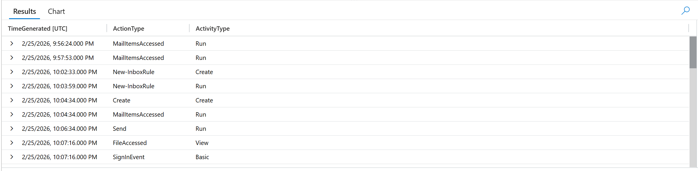

---

### 🚩 Flag 10: Rule Creation Method

**What to find:** Sophisticated attackers establish persistence to maintain access. Inbox rules are a favourite: silent, persistent, and often overlooked. Query CloudAppEvents for anything related to email rule creation.

**Flag Data Block**

| Field | Value |
|---|---|
| **Answer** | New-InboxRule |
| **Time (UTC)** | 2026-02-25T22:02:33Z |

**Details:** A search through CloudAppEvents for email rule creation activity during the attack window surfaces a New-InboxRule action, showing the attacker established silent, persistent access via a mailbox rule rather than relying solely on repeated logins.

**Query:** Same as Flag 9

---

### 🚩 Flag 11: Forward Rule Name

**What to find:** Attackers name rules strategically to be as inconspicuous as possible. Examine the RawEventData for the inbox rule creation event and find the Name parameter.

**Flag Data Block**

| Field | Value |
|---|---|
| **Answer** | . |
| **Time (UTC)** | 2026-02-25T22:02:33Z |

**Details:** Examining the RawEventData parameters for the New-InboxRule creation event shows the rule was named ".", a deliberately inconspicuous single-character name chosen to avoid drawing attention in the rules list.

**Query:**
```kql
CloudAppEvents
| where TimeGenerated between (datetime(2026-02-25 21:00:00) .. datetime(2026-02-26 00:00:00))
| where IPAddress == "205.147.16.190"
| where ActionType == "New-InboxRule"
| project TimeGenerated, ActionType, tostring(RawEventData.Parameters)
| order by TimeGenerated asc
```

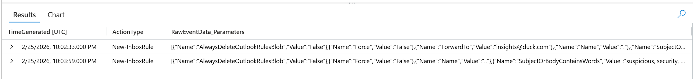

---

### 🚩 Flag 12: Forward Destination

**What to find:** The external email receiving forwarded messages is attacker-controlled infrastructure, a critical IOC for email gateway blocking. Find the ForwardTo parameter.

**Flag Data Block**

| Field | Value |
|---|---|
| **Answer** | insights@duck.com |
| **Time (UTC)** | 2026-02-25T22:02:33Z |

**Details:** The ForwardTo parameter in the same inbox rule configuration identifies insights@duck.com as the external, attacker-controlled address silently receiving forwarded mail, a critical IOC for email gateway blocking.

**Query:** Same as Flag 11

---

### 🚩 Flag 13: Forward Keywords

**What to find:** The keywords triggering the forwarding rule reveal what data the attacker wants. Find the SubjectOrBodyContainsWords parameter.

**Flag Data Block**

| Field | Value |
|---|---|
| **Answer** | invoice, payment, wire, transfer |
| **Time (UTC)** | 2026-02-25T22:02:33Z |

**Details:** The SubjectOrBodyContainsWords parameter on the same inbox rule shows the forwarding was triggered by the keywords invoice, payment, wire, and transfer, confirming the attacker's objective was financial fraud rather than general mailbox surveillance.

**Query:** Same as Flag 11

---

### 🚩 Flag 14: Rule Processing Flag

**What to find:** Smart attackers configure rules so no other rules process the matched emails afterward, preventing the user's own rules from alerting them. What parameter ensures this?

**Flag Data Block**

| Field | Value |
|---|---|
| **Answer** | StopProcessingRules |
| **Time (UTC)** | 2026-02-25T22:02:33Z |

**Details:** The same inbox rule configuration includes the StopProcessingRules parameter, ensuring no subsequent rules could process matched invoice/payment emails and preventing any of the victim's own rules from surfacing an alert.

**Query:** Same as Flag 11

---

### 🚩 Flag 15: Delete Rule Name

**What to find:** Are there more rules? Smart attackers don't just steal, they hide. Query CloudAppEvents for all inbox rule creation events in the window and find the second rule's name.

**Flag Data Block**

| Field | Value |
|---|---|
| **Answer** | .. |
| **Time (UTC)** | 2026-02-25T22:03:59Z |

**Details:** Querying CloudAppEvents for all inbox rule creation events in the attack window reveals a second rule, named "..", created shortly after the forwarding rule, the attacker following the same inconspicuous naming pattern to stay hidden from a casual review of the rules list.

**Query:** Same as Flag 11

---

### 🚩 Flag 16: Delete Keywords

**What to find:** The keywords targeted for deletion reveal what the attacker wants to hide. Parse the second rule's configuration.

**Flag Data Block**

| Field | Value |
|---|---|
| **Answer** | suspicious, security, phishing, unusual, compromised, verify |
| **Time (UTC)** | 2026-02-25T22:03:59Z |

**Details:** Parsing the configuration of the second rule ("..") shows it targets emails containing suspicious, security, phishing, unusual, compromised, and verify, the attacker deleting exactly the kind of security alerts that would tip off the victim to the compromise.

**Query:** Same as Flag 11

---

### 🚩 Flag 17: BEC Target

**What to find:** Persistence established, evidence hidden. Now find the fraud. Pivot to EmailEvents, filter by the compromised account as sender and the attacker's IP. Who received the fraudulent email?

**Flag Data Block**

| Field | Value |
|---|---|
| **Answer** | j.reynolds@lognpacific.org |
| **Time (UTC)** | 2026-02-25T22:06:39Z |

**Details:** Pivoting to EmailEvents and filtering on the compromised account as sender and the attacker's IP identifies j.reynolds@lognpacific.org as the recipient of the fraudulent invoice email.

**Query:**
```kql
EmailEvents
| where TimeGenerated between (datetime(2026-02-25 21:00:00) .. datetime(2026-02-26 00:00:00))
| where SenderIPv4 == "205.147.16.190"
| where SenderFromAddress == "m.smith@lognpacific.org"
```

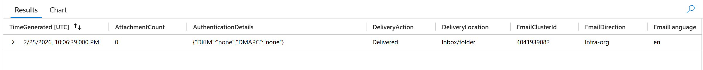

---

### 🚩 Flag 18: BEC Subject Line

**What to find:** The subject line reveals the social engineering pretext. Did the attacker reply to an existing thread rather than create a new email?

**Flag Data Block**

| Field | Value |
|---|---|
| **Answer** | RE: Invoice #INV-2026-0892 - Updated Banking Details |
| **Time (UTC)** | 2026-02-25T22:06:39Z |

**Details:** The same EmailEvents record shows the subject line "RE: Invoice #INV-2026-0892 - Updated Banking Details", confirming the attacker hijacked an existing invoice thread rather than initiating a new email, lending the fraudulent message false legitimacy.

**Query:** Same as Flag 17

---

### 🚩 Flag 19: Email Direction

**What to find:** Was this email sent externally or within the organisation? The direction determines whether email gateway rules could ever have caught it.

**Flag Data Block**

| Field | Value |
|---|---|
| **Answer** | Intra-org |
| **Time (UTC)** | 2026-02-25T22:06:39Z |

**Details:** The EmailDirection field on the same EmailEvents record shows Intra-org, meaning the fraudulent invoice email stayed entirely within the organisation's own mail flow, explaining why external email gateway rules would never have had a chance to catch it.

**Query:** Same as Flag 17

---

### 🚩 Flag 20: BEC Sender IP

**What to find:** Cross-correlate. The SenderIPv4 on the BEC email should match the attacker's sign-in IP, proving the same session was used for authentication and email sending.

**Flag Data Block**

| Field | Value |
|---|---|
| **Answer** | 205.147.16.190 |
| **Time (UTC)** | N/A |

**Details:** Cross-correlating the SenderIPv4 on the fraudulent invoice email against the attacker's sign-in IP confirms they match at 205.147.16.190, proving the same session used to authenticate as m.smith was also used to send the BEC email directly.

**Query:** N/A

---

### 🚩 Flag 21: Cloud App Accessed

**What to find:** The fraud is confirmed. Did the attacker access anything beyond email? Query CloudAppEvents filtered to the attacker's IP and look for file access ActionTypes.

**Flag Data Block**

| Field | Value |
|---|---|
| **Answer** | Microsoft OneDrive for Business |
| **Time (UTC)** | 2026-02-25T22:07:16Z |

**Details:** Filtering CloudAppEvents to the attacker's IP and reviewing file access ActionTypes shows the attacker also touched Microsoft OneDrive for Business, extending the compromise's scope beyond just email fraud into the account's cloud file storage.

**Query:**
```kql
CloudAppEvents
| where TimeGenerated between (datetime(2026-02-25 21:00:00) .. datetime(2026-02-26 00:00:00))
| where IPAddress == "205.147.16.190"
| where ActionType contains "access"
| project TimeGenerated, ActionType, Application
| order by TimeGenerated asc
```

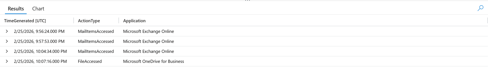

---

### 🚩 Flag 22: SharePoint App Accessed

**What to find:** The attacker did not stop at personal files. Query CloudAppEvents for the attacker's IP and identify what other application was accessed.

**Flag Data Block**

| Field | Value |
|---|---|
| **Answer** | Microsoft SharePoint Online |
| **Time (UTC)** | 2026-02-25T22:07:16Z |

**Details:** A distinct-application check on CloudAppEvents for the attacker's IP shows Microsoft SharePoint Online was also accessed, confirming the attacker moved beyond personal file storage into shared organisational content during the same session.

**Query:**
```kql
CloudAppEvents
| where TimeGenerated between (datetime(2026-02-25 21:00:00) .. datetime(2026-02-26 00:00:00))
| where IPAddress == "205.147.16.190"
| distinct ActionType, Application
```

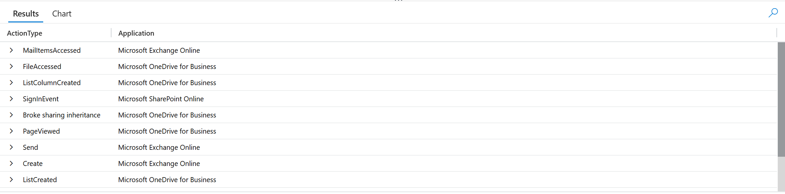

---

### 🚩 Flag 23: Session Correlation

**What to find:** One identifier links all attacker activity across sign-ins, inbox rules, and email. Check the CloudAppEvents inbox rule events for AppAccessContext.AADSessionId, then confirm it matches SigninLogs.

**Flag Data Block**

| Field | Value |
|---|---|
| **Answer** | 00225cfa-a0ff-fb46-a079-5d152fcdf72a |
| **Time (UTC)** | 2026-02-25T21:57:53Z |

**Details:** Extracting AppAccessContext.AADSessionId from RawEventData on the CloudAppEvents inbox rule activity and confirming it matches the SessionId on the attacker's successful sign-in in SigninLogs establishes 00225cfa-a0ff-fb46-a079-5d152fcdf72a as the single session ID tying the authentication, inbox rule creation, and email activity together into one continuous attacker session.

**Query:**
```kql
CloudAppEvents
| where TimeGenerated between (datetime(2026-02-25 21:00:00) .. datetime(2026-02-26 00:00:00))
| where IPAddress == "205.147.16.190"
| take 1
```

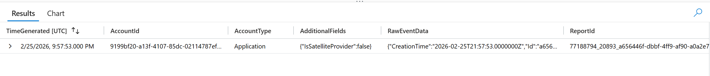

---

### 🚩 Flag 24: Conditional Access Status

**What to find:** The investigation is scoped. What failed in the defences, could this have been stopped? Check the attacker's successful sign-in for ConditionalAccessStatus.

**Flag Data Block**

| Field | Value |
|---|---|
| **Answer** | notApplied |
| **Time (UTC)** | 2026-02-25T21:54:24.731913Z |

**Details:** Checking the ConditionalAccessStatus on the attacker's successful sign-in shows notApplied, meaning no Conditional Access policy evaluated or intervened in the session despite the unmanaged Linux/Firefox device and foreign IP, a clear gap in the defences that could have stopped this.

**Query:**
```kql
SigninLogs
| where TimeGenerated between (datetime(2026-02-25 21:00:00) .. datetime(2026-02-26 00:00:00))
| where IPAddress == "205.147.16.190"
| where ResultType == "50074"
| project TimeGenerated, ConditionalAccessStatus
```

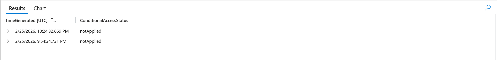

---

### 🚩 Flag 25: MFA Fatigue MITRE ID

**What to find:** Map the MFA fatigue technique to MITRE ATT&CK. What technique ID describes repeated MFA push notifications to wear down the user?

**Flag Data Block**

| Field | Value |
|---|---|
| **Answer** | T1621 |
| **Time (UTC)** | N/A |

**Details:** Mapping the repeated MFA push notifications used to wear down Mark into approving a fraudulent request corresponds to MITRE ATT&CK technique T1621 (Multi-Factor Authentication Request Generation).

**Query:** N/A

---

### 🚩 Flag 26: Email Rules MITRE ID

**What to find:** The attacker created inbox rules to hide evidence. Map this defence evasion technique to MITRE ATT&CK, with sub-technique.

**Flag Data Block**

| Field | Value |
|---|---|
| **Answer** | T1564.008 |
| **Time (UTC)** | N/A |

**Details:** Mapping the attacker's use of inbox rules to forward invoice-related mail and delete security alerts to MITRE ATT&CK identifies T1564.008 (Hide Artifacts: Email Hiding Rules) as the defence evasion technique used to conceal activity from Mark.

**Query:** N/A

---

### 🚩 Flag 27: Credential Source

**What to find:** The attacker already had Mark's password before the MFA fatigue attack started. The threat group behind this attack is known for purchasing credentials from a specific malware category. Name it.

**Flag Data Block**

| Field | Value |
|---|---|
| **Answer** | Infostealer |
| **Time (UTC)** | N/A |

**Details:** The threat group's known pattern of purchasing pre-harvested credentials points to infostealer malware as the likely source of Mark's compromised password, malware that harvests saved passwords, session tokens, and browser data from infected machines and sells the output on criminal marketplaces, explaining why the attacker already had valid credentials before the MFA fatigue attack began.

**Query:** N/A

---

### 🚩 Flag 28: Immediate Containment

**What to find:** Full kill chain mapped. The attacker still has a valid session and both inbox rules are still active. What is the single most important first containment action?

**Flag Data Block**

| Field | Value |
|---|---|
| **Answer** | Revoke sessions |
| **Time (UTC)** | N/A |

**Details:** With the attacker still holding a live session (00225cfa-a0ff-fb46-a079-5d152fcdf72a) and both inbox rules still active, the priority containment action is to revoke sessions immediately, invalidating the attacker's access token before any other remediation. Revoking the session stops the attacker from re-authenticating or taking any further action, but it does not touch the inbox rules themselves: those are server-side objects that keep running independently of any session and require a separate, explicit deletion step.

**Query:** N/A

---

### 🚩 Flag 29: Threat Actor Attribution

**What to find:** MFA fatigue, inbox rule persistence, BEC targeting finance, and anonymising infrastructure. The briefing mentioned a group that targeted MGM Resorts and Caesars Entertainment. Who did this?

**Flag Data Block**

| Field | Value |
|---|---|
| **Answer** | Scattered Spider |
| **Time (UTC)** | N/A |

**Details:** The combined pattern across the investigation, MFA fatigue against Mark, T1564.008 inbox-rule persistence, BEC targeting finance, and anonymising infrastructure at 205.147.16.190, matches the known TTPs of Scattered Spider, the group referenced in the briefing for the MGM Resorts and Caesars Entertainment intrusions.

**Query:** N/A

---

## 🛡️ Security Recommendations

1. **Enforce Conditional Access and phishing-resistant MFA.** ConditionalAccessStatus reading notApplied on this session is the root defensive gap. Require device compliance and location-based policies on all sign-ins, and move high-value accounts off push-based MFA toward number matching or FIDO2 to shut down push-fatigue attacks like T1621.

2. **Detect and alert on mailbox rule creation, not just content.** New-InboxRule events with single-character or non-obvious names, external ForwardTo addresses, or StopProcessingRules combined with security-related delete keywords should generate a high-priority alert on creation, not be left for manual discovery after the fraud has already happened.

3. **Correlate identity, cloud app, and email telemetry by session ID during response.** The full attack chain here was only provable by tying SigninLogs, CloudAppEvents, and EmailEvents together through AADSessionId and source IP. Build this correlation into standard triage, and on containment revoke the session immediately while treating rule removal as a separate, mandatory step it does not automatically cover.

---


